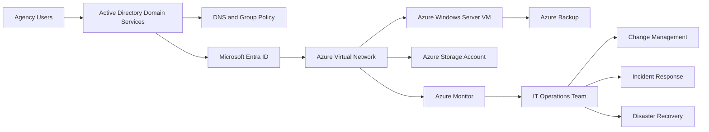

# Federal Hybrid IT Operations Portfolio

Enterprise hybrid IT operations portfolio demonstrating Windows Server, Active Directory, Microsoft Entra ID, Azure infrastructure, PowerShell automation, monitoring, change management, vulnerability remediation, incident response, and disaster recovery practices.

## Purpose

This repository presents a practical operating model for a fictional federal benefits organization modernizing a mission-critical Microsoft environment. The design emphasizes service availability, secure identity, controlled change, recoverability, operational visibility, and technical team leadership.

The environment is intentionally fictional and contains no proprietary agency information, production credentials, tenant identifiers, or sensitive configuration data.

## Start Here

The portfolio is being implemented as one cohesive enterprise environment rather than a collection of disconnected labs.

1. Review the [Local Hyper-V Enterprise Lab Blueprint](architecture/local-hyperv-lab-blueprint.md).
2. Follow the [Enterprise Lab Build Roadmap](operations/lab-build-roadmap.md).
3. Use the [Active Directory Health Assessment](automation/Test-ADHealth.md) after the first domain controller is operational.

The initial design is optimized for a Windows 11 Pro Hyper-V host with 16 GB of RAM and approximately 473 GB of available SSD storage. Virtual machines are started in small operating sets until the host memory is upgraded.

## Scenario

A federal benefits organization must maintain uninterrupted access to core services while integrating on-premises Windows infrastructure with Microsoft Azure. The IT operations team is responsible for:

- Active Directory Domain Services and Group Policy
- Microsoft Entra ID and hybrid identity
- Windows Server and Azure virtual machines
- Azure networking, storage, monitoring, and backup
- PowerShell automation
- Vulnerability and patch management
- Change and release control
- Incident response and escalation
- Disaster recovery and continuity planning
- Weekly operational reporting to leadership

## Architecture

## Repository Structure

- `architecture/` — current-state, target-state, local lab, and data-flow documentation
- `identity/` — hybrid identity, OU design, access control, and Group Policy baseline
- `azure/` — networking, NSG, storage, monitoring, and backup design
- `automation/` — PowerShell operational scripts and usage guides
- `operations/` — build roadmap, daily checks, monitoring, backup, patching, and vulnerability management
- `change-management/` — impact assessment, implementation, validation, and rollback
- `incident-response/` — operational incident playbooks
- `leadership/` — prioritization, escalation, weekly reporting, and executive communication

## Current Implementation Status

| Capability | Status |
|---|---|
| Portfolio operating model | Complete |
| Local Hyper-V architecture blueprint | Complete |
| Enterprise lab build roadmap | Complete |
| Active Directory health automation | Complete; live lab validation pending |
| Hyper-V host deployment automation | Next |
| DC01 and forest deployment | Planned |
| Windows 11 client integration | Planned |
| DC02 redundancy | Planned |
| File services | Planned |
| Monitoring and recovery | Planned |
| Azure hybrid integration | Planned |

## Operating Principles

1. Protect production availability.
2. Apply least privilege and separation of duties.
3. Automate repeatable administrative work.
4. Test changes before implementation.
5. Define measurable rollback criteria.
6. Monitor service health and capacity continuously.
7. Verify backups through restoration testing.
8. Escalate risk early and communicate clearly.
9. Prioritize work by mission impact and urgency.
10. Document decisions, ownership, and outcomes.

## Key Demonstrations

### Hybrid Identity

The identity design combines Active Directory Domain Services with Microsoft Entra ID while maintaining role-based access, administrative tiering, lifecycle controls, and auditable account management.

### Production Change Assessment

The change-management package demonstrates how to evaluate technical dependencies, security implications, operational risk, testing requirements, maintenance windows, and rollback conditions before introducing a new Azure-connected service.

### Operational Automation

The PowerShell toolkit includes scripts for Active Directory health, inactive-account detection, Windows Server health, backup-status review, and controlled user provisioning.

### Leadership Reporting

The weekly operations report converts technical metrics into concise management information covering availability, vulnerabilities, backups, changes, incidents, risks, and priorities.

## Security Notice

All names, systems, addresses, identifiers, and metrics in this repository are examples. Scripts must be reviewed and tested in a non-production environment before use.

## Author

Henry Jenkins  
Senior IT Operations | Cybersecurity | Infrastructure Engineering
