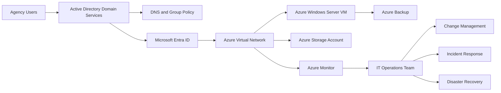

# Federal Hybrid IT Operations Portfolio

Enterprise hybrid IT operations portfolio demonstrating Windows Server, Active Directory, Microsoft Entra ID, Azure infrastructure, PowerShell automation, monitoring, change management, vulnerability remediation, incident response, and disaster recovery practices.

## Latest Progress: July 28, 2026

The portfolio has advanced from Active Directory health monitoring into controlled infrastructure deployment. A new DC01 automation package now prepares the server, deploys the `corp.hjfb.lab` forest, and validates the completed domain controller with HTML and JSON evidence.

**Featured deployment artifact:** [DC01 Deployment Automation](automation/DC01/README.md)

**Featured operations artifact:** [Active Directory Health Assessment Toolkit](automation/ADHealthAssessment/README.md)

**Latest update:** [Read the July 28, 2026 Enterprise Infrastructure Portfolio Update](docs/portfolio-update-2026-07-28.md)

### Milestone Snapshot

| Phase | Milestone | Status |
|---|---|---|
| Foundation | Portfolio operating model | Complete |
| Architecture | Local Hyper-V enterprise blueprint | Complete |
| Planning | Enterprise lab build roadmap | Complete |
| Automation | Active Directory health assessment toolkit | Complete, live validation pending |
| Automation | DC01 deployment automation package | Complete, live execution pending |
| Core Infrastructure | DC01 and forest deployment | Current |
| Network Services | DNS and DHCP post-deployment configuration | Next |
| Endpoint Integration | Windows 11 domain client | Upcoming |
| Resilience | DC02 redundancy and recovery validation | Upcoming |
| Hybrid Cloud | Microsoft Entra ID and Azure integration | Future |

## Portfolio Roadmap

```mermaid
flowchart LR
    A[Completed: Operating Model] --> B[Completed: Hyper-V Architecture]
    B --> C[Completed: Lab Build Roadmap]
    C --> D[Completed: AD Health Toolkit]
    D --> E[Completed: DC01 Automation Package]
    E --> F[Current: Execute DC01 and Forest Build]
    F --> G[Next: DNS and DHCP Configuration]
    G --> H[Validate AD Health Toolkit]
    H --> I[Upcoming: Windows 11 Client]
    I --> J[Upcoming: DC02 and File Services]
    J --> K[Future: Monitoring and Recovery]
    K --> L[Future: Azure Hybrid Integration]
```

## Purpose

This repository presents a practical operating model for a fictional federal benefits organization modernizing a mission-critical Microsoft environment. The design emphasizes service availability, secure identity, controlled change, recoverability, operational visibility, and technical team leadership.

The environment is intentionally fictional and contains no proprietary agency information, production credentials, tenant identifiers, or sensitive configuration data.

## Start Here

The portfolio is being implemented as one cohesive enterprise environment rather than a collection of disconnected labs.

1. Review the [Local Hyper-V Enterprise Lab Blueprint](architecture/local-hyperv-lab-blueprint.md).
2. Follow the [Enterprise Lab Build Roadmap](operations/lab-build-roadmap.md).
3. Review the [Automation Portfolio Index](automation/README.md).
4. Execute the [DC01 Deployment Automation](automation/DC01/README.md) in the isolated lab.
5. Validate the completed server with `Test-DC01Deployment.ps1`.
6. Run the [Active Directory Health Assessment Toolkit](automation/ADHealthAssessment/README.md) and compare its findings with `dcdiag` and `repadmin`.

The initial design is optimized for a Windows 11 Pro Hyper-V host with 16 GB of RAM and approximately 473 GB of available SSD storage. Virtual machines are started in small operating sets until the host memory is upgraded.

## Featured Engineering Artifacts

### DC01 Deployment Automation

The DC01 package demonstrates phased infrastructure deployment rather than an undifferentiated build script. It includes:

- Static network configuration and server naming
- AD DS, DNS, and DHCP role installation
- Secure forest deployment for `corp.hjfb.lab`
- Runtime-only handling of the DSRM password
- PowerShell `ShouldProcess` and `-WhatIf` support
- Post-deployment validation using Active Directory, DNS, SMB, service, `dcdiag`, and `repadmin` checks
- HTML and JSON validation reports

See the [DC01 deployment guide](automation/DC01/README.md).

### Active Directory Health Assessment Toolkit

The toolkit performs a read-only assessment of core directory services and produces both an executive-friendly HTML report and machine-readable JSON evidence. It demonstrates:

- Active Directory forest and domain discovery
- Domain controller inventory and resiliency checks
- NTDS, DNS, Netlogon, DFS Replication, and Windows Time service validation
- Replication analysis using `repadmin`
- DNS zone and domain-controller SRV record validation
- FSMO role-holder discovery
- Critical and error event-log analysis
- Actionable remediation guidance and monitoring-friendly exit codes

See the [toolkit documentation](automation/ADHealthAssessment/README.md), [health-check catalog](automation/ADHealthAssessment/docs/Health-Checks.md), and [sanitized report samples](automation/ADHealthAssessment/reports/README.md).

## Scenario

A federal benefits organization must maintain uninterrupted access to core services while integrating on-premises Windows infrastructure with Microsoft Azure. The IT operations team is responsible for:

- Active Directory Domain Services and Group Policy
- Microsoft Entra ID and hybrid identity
- Windows Server and Azure virtual machines
- Azure networking, storage, monitoring, and backup
- PowerShell automation
- Vulnerability and patch management
- Change and release control
- Incident response and escalation
- Disaster recovery and continuity planning
- Weekly operational reporting to leadership

## Architecture

```mermaid
flowchart LR
    Users[Agency Users] --> AD[Active Directory Domain Services]
    AD --> DNS[DNS and Group Policy]
    AD --> Entra[Microsoft Entra ID]
    Entra --> Azure[Azure Virtual Network]
    Azure --> VM[Azure Windows Server VM]
    Azure --> Storage[Azure Storage Account]
    Azure --> Monitor[Azure Monitor]
    VM --> Backup[Azure Backup]
    Monitor --> Ops[IT Operations Team]
    Ops --> Change[Change Management]
    Ops --> IR[Incident Response]
    Ops --> DR[Disaster Recovery]
```

## Repository Structure

- `architecture/` - current-state, target-state, local lab, and data-flow documentation
- `identity/` - hybrid identity, OU design, access control, and Group Policy baseline
- `azure/` - networking, NSG, storage, monitoring, and backup design
- `automation/` - PowerShell deployment, operational tooling, usage guides, sample reports, and validation procedures
- `operations/` - build roadmap, daily checks, monitoring, backup, patching, and vulnerability management
- `change-management/` - impact assessment, implementation, validation, and rollback
- `incident-response/` - operational incident playbooks
- `leadership/` - prioritization, escalation, weekly reporting, and executive communication
- `docs/` - progress updates, lessons learned, troubleshooting records, and project roadmap

## Current Implementation Status

| Capability | Status |
|---|---|
| Portfolio operating model | Complete |
| Local Hyper-V architecture blueprint | Complete |
| Enterprise lab build roadmap | Complete |
| Active Directory health automation | Complete, live lab validation pending |
| DC01 prerequisite automation | Complete, live execution pending |
| HJFB forest deployment automation | Complete, live execution pending |
| DC01 deployment validation | Complete, live execution pending |
| DNS and DHCP post-deployment configuration | Next |
| Windows 11 client integration | Planned |
| DC02 redundancy | Planned |
| File services | Planned |
| Monitoring and recovery | Planned |
| Azure hybrid integration | Planned |
| Demonstration video | Planned |

## Operating Principles

1. Protect production availability.
2. Apply least privilege and separation of duties.
3. Automate repeatable administrative work.
4. Test changes before implementation.
5. Define measurable rollback criteria.
6. Monitor service health and capacity continuously.
7. Verify backups through restoration testing.
8. Escalate risk early and communicate clearly.
9. Prioritize work by mission impact and urgency.
10. Document decisions, ownership, and outcomes.

## Key Demonstrations

### Hybrid Identity

The identity design combines Active Directory Domain Services with Microsoft Entra ID while maintaining role-based access, administrative tiering, lifecycle controls, and auditable account management.

### Production Change Assessment

The change-management package demonstrates how to evaluate technical dependencies, security implications, operational risk, testing requirements, maintenance windows, and rollback conditions before introducing a new Azure-connected service.

### Operational Automation

The [automation portfolio](automation/README.md) demonstrates phased deployment, structured PowerShell engineering, dry-run support, secure secret handling, read-only health validation, standardized reporting, meaningful exit codes, and future integration with scheduled tasks, monitoring platforms, and CI quality gates.

### Leadership Reporting

The weekly operations report converts technical metrics into concise management information covering availability, vulnerabilities, backups, changes, incidents, risks, and priorities.

## Security Notice

All names, systems, addresses, identifiers, and metrics in this repository are examples. Scripts must be reviewed and tested in a non-production environment before use. Generated reports may contain internal hostnames, domains, event details, and infrastructure metadata and should be handled according to organizational data-classification requirements.

## Author

Henry Jenkins  
Senior IT Operations | Cybersecurity | Infrastructure Engineering
