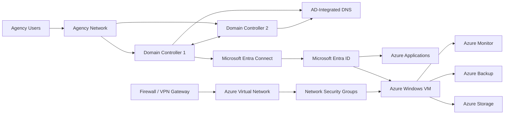

# Hybrid Infrastructure Architecture

## Scenario

A fictional federal benefits organization operates mission-critical services across an on-premises Windows environment and Microsoft Azure. The design supports secure identity, resilient operations, controlled modernization, and auditable administration.

## Logical Architecture

## Design Principles

1. **Availability first:** Redundant domain controllers, monitored dependencies, tested recovery procedures, and controlled maintenance windows.
2. **Least privilege:** Role-based groups, tiered administration, separate privileged accounts, and periodic access reviews.
3. **Defense in depth:** Segmented networks, restrictive NSG rules, endpoint protection, logging, vulnerability remediation, and backup isolation.
4. **Change control:** Every production change includes testing, impact analysis, approval, rollback criteria, and validation.
5. **Operational visibility:** Central monitoring, service health checks, backup reporting, capacity alerts, and executive-level metrics.

## Core Components

| Component | Purpose | Operational Considerations |
|---|---|---|
| Active Directory Domain Services | Authentication, authorization, policy | Replication health, privileged groups, stale accounts |
| AD-integrated DNS | Name resolution | Zone health, secure updates, forwarder availability |
| Microsoft Entra ID | Cloud identity and access | Conditional Access, MFA, risky sign-ins, sync health |
| Azure Virtual Network | Cloud network boundary | Address planning, routing, DNS, peering |
| Network Security Groups | Traffic filtering | Least-access rules, logging, periodic review |
| Azure Monitor | Telemetry and alerting | Alert tuning, ownership, escalation paths |
| Azure Backup | Recovery capability | Policy compliance, restore testing, retention |
| PowerShell | Repeatable administration | Logging, error handling, code review, signed scripts |

## Administrative Model

- Tier 0: Domain controllers, identity synchronization, privileged identity systems.
- Tier 1: Member servers, Azure infrastructure, backup, monitoring.
- Tier 2: Workstations and user support.
- Administrators use separate privileged accounts and do not use Tier 0 credentials for routine activity.
- Emergency access accounts are tightly controlled, monitored, and tested.

## Assumptions

This portfolio uses a fictional environment. It contains no agency-sensitive information, credentials, production identifiers, or proprietary architecture.