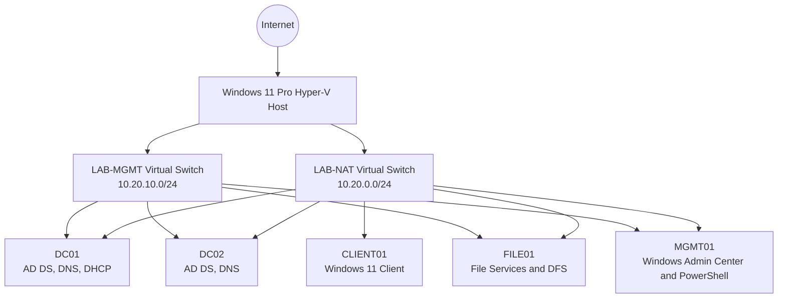

# Local Hyper-V Enterprise Lab Blueprint

## Purpose

This blueprint defines the local infrastructure environment used throughout the Federal Hybrid IT Operations Portfolio. The lab is designed for a Windows 11 Pro Hyper-V host with a high-core-count processor, 16 GB of RAM, and approximately 473 GB of available SSD storage.

The design prioritizes repeatability, low resource usage, safe testing, enterprise documentation, and future expansion to Microsoft Azure and Microsoft Entra ID.

## Design Principles

1. Keep only the virtual machines required for the current exercise running.
2. Use Server Core where practical to reduce memory and disk consumption.
3. Separate infrastructure roles so each service can be documented and tested independently.
4. Use checkpoints only before controlled changes, not as a replacement for backup.
5. Store no credentials, product keys, tenant identifiers, or sensitive data in GitHub.
6. Build every component from documented procedures and automation where possible.

## Logical Architecture



## Domain and Naming Standard

| Item | Value |
|---|---|
| Lab organization | Henry Jenkins Federal Benefits Lab |
| Active Directory DNS domain | `corp.hjfb.lab` |
| NetBIOS name | `HJFB` |
| Primary site | `HQ` |
| Host naming pattern | Role plus two-digit sequence |
| Administrative account pattern | `adm-firstname.lastname` |
| Standard user pattern | `firstname.lastname` |
| Service account pattern | `svc-purpose` |

The `.lab` namespace is used only inside the isolated training environment. It must not be published to public DNS.

## Network Plan

| Network | Purpose | Address Space | Gateway | DHCP Scope |
|---|---|---:|---:|---:|
| LAB-NAT | Servers, clients, and controlled internet access | `10.20.0.0/24` | `10.20.0.1` | `10.20.0.100-10.20.0.199` |
| LAB-MGMT | Host-only administration and recovery | `10.20.10.0/24` | None | None |
| Future DMZ | IIS and reverse-proxy testing | `10.20.20.0/24` | `10.20.20.1` | None |

### Initial Static Addresses

| System | LAB-NAT IP | LAB-MGMT IP | Primary Role |
|---|---:|---:|---|
| DC01 | `10.20.0.10` | `10.20.10.10` | AD DS, DNS, DHCP, initial FSMO holder |
| DC02 | `10.20.0.11` | `10.20.10.11` | Additional domain controller and DNS |
| FILE01 | `10.20.0.20` | `10.20.10.20` | SMB, NTFS, DFS namespace and replication |
| MGMT01 | `10.20.0.30` | `10.20.10.30` | Windows Admin Center, RSAT, PowerShell |
| CLIENT01 | DHCP reservation | Optional | Windows 11 domain client |

All domain members use DC01 and DC02 as DNS servers. Public resolvers are configured only as DNS forwarders on the domain controllers.

## Virtual Machine Resource Plan

### Phase 1: Current 16 GB Host

Only the machines required for the active task should run simultaneously.

| VM | Generation | vCPU | Startup RAM | Minimum RAM | Maximum RAM | OS Disk |
|---|---:|---:|---:|---:|---:|---:|
| DC01 | 2 | 2 | 2 GB | 1.5 GB | 3 GB | 50 GB dynamic |
| MGMT01 | 2 | 2 | 2 GB | 1.5 GB | 3 GB | 60 GB dynamic |
| CLIENT01 | 2 | 2 | 3 GB | 2 GB | 4 GB | 64 GB dynamic |
| DC02 | 2 | 2 | 2 GB | 1.5 GB | 3 GB | 50 GB dynamic |
| FILE01 | 2 | 2 | 2 GB | 1.5 GB | 3 GB | 50 GB OS plus 40 GB data |

Recommended simultaneous operating sets:

- Foundation build: DC01 + CLIENT01
- Administration: DC01 + MGMT01
- Replication testing: DC01 + DC02
- File services testing: DC01 + FILE01 + CLIENT01

### Phase 2: After 32 GB or 64 GB Upgrade

Add PKI01, WSUS01, WEB01, monitoring, Linux, firewall, and additional client systems. The original IP and naming plan remains unchanged.

## Server Role Roadmap

| Phase | System | Capabilities |
|---:|---|---|
| 1 | DC01 | Forest deployment, DNS, DHCP, Group Policy, initial automation |
| 2 | CLIENT01 | Domain join, GPO validation, RSAT and user testing |
| 3 | DC02 | AD and DNS redundancy, replication and FSMO exercises |
| 4 | FILE01 | SMB shares, AGDLP permissions, quotas, DFS and backup |
| 5 | MGMT01 | Central administration, Windows Admin Center, event collection |
| 6 | PKI01 | Enterprise certificate authority and certificate templates |
| 7 | WSUS01 | Update approval, patch rings and compliance reporting |
| 8 | WEB01 | IIS workload, DMZ controls and certificate deployment |
| 9 | Azure | Entra integration, Arc, Monitor, Backup and hybrid operations |

## Active Directory Organizational Unit Design

```text
corp.hjfb.lab
├── Admin
│   ├── Accounts
│   ├── Groups
│   └── Workstations
├── Corporate
│   ├── Users
│   │   ├── Executive
│   │   ├── Finance
│   │   ├── Human-Resources
│   │   ├── Information-Technology
│   │   └── Operations
│   ├── Computers
│   │   ├── Workstations
│   │   └── Laptops
│   └── Groups
├── Servers
│   ├── Domain-Controllers
│   ├── File-Servers
│   ├── Management-Servers
│   └── Application-Servers
├── Service-Accounts
├── Disabled-Objects
└── Tiering
    ├── Tier-0
    ├── Tier-1
    └── Tier-2
```

## Group Policy Baseline

The initial implementation will include separate GPOs for:

- Domain password and account-lockout policy
- Microsoft Defender and Windows Firewall
- Advanced audit policy
- Windows Update behavior
- Screen lock and inactivity timeout
- PowerShell logging
- Restricted local administrators
- RDP restrictions
- BitLocker readiness
- Workstation security baseline
- Domain controller security baseline

GPOs must be scoped narrowly, documented, backed up before modification, and validated with `gpresult` and event logs.

## Storage Layout

Recommended host folders:

```text
C:\Hyper-V\
├── ISO\
├── VMs\
│   ├── DC01\
│   ├── DC02\
│   ├── FILE01\
│   ├── MGMT01\
│   └── CLIENT01\
├── Templates\
├── Exports\
└── Evidence\
```

Dynamic VHDX files reduce initial storage consumption. The host must retain at least 100 GB of free space to support checkpoints, updates, exports, and recovery operations.

## Security Controls

- Hyper-V host remains outside the lab domain.
- Lab administrative credentials are unique and never reused for personal accounts.
- Secure Boot and virtual TPM are enabled where supported.
- Internet access is disabled for isolated security exercises.
- Defender and host firewall remain enabled.
- GitHub stores only sanitized configurations and evidence.
- Evaluation software is used only for testing, training, and demonstration.

## Build Sequence

1. Enable Hyper-V and required management tools.
2. Create the LAB-NAT and LAB-MGMT virtual switches.
3. Create the host NAT configuration for `10.20.0.0/24`.
4. Download and verify Microsoft evaluation installation media.
5. Build DC01 and assign its static network configuration.
6. Deploy the `corp.hjfb.lab` forest and DNS.
7. Configure DHCP and authorize the server.
8. Build and join CLIENT01.
9. Create the OU, group, user, and GPO baseline.
10. Run the repository AD health script and capture sanitized evidence.
11. Add DC02 and validate replication and DNS redundancy.
12. Add FILE01 and continue through the server role roadmap.

## Validation Gates

A phase is complete only after its evidence is committed to the repository.

| Gate | Required Evidence |
|---|---|
| Hyper-V foundation | Switch configuration, VM inventory and host screenshots |
| Domain deployment | AD domain output, DNS resolution and SYSVOL evidence |
| Client integration | Domain membership, user sign-in and GPO results |
| Redundancy | Replication summary, DCDIAG and DNS failover test |
| File services | Share access, effective permissions and restore test |
| Operations | Health report, event review, backup status and runbook |

## Portfolio Outcome

This environment supports demonstrations of Windows Server engineering, Active Directory, DNS, DHCP, Group Policy, PowerShell, virtualization, security hardening, monitoring, incident response, change management, disaster recovery, and future Azure hybrid integration.
